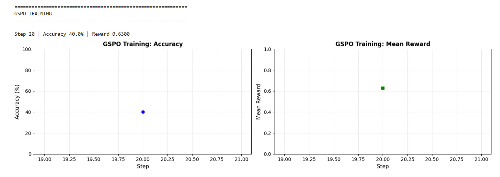
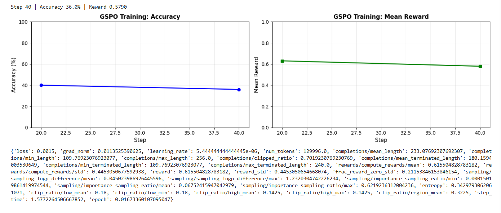
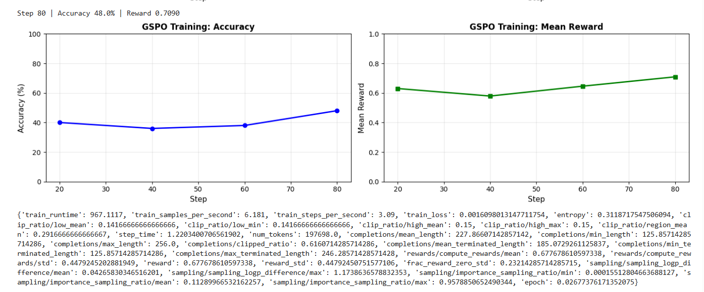

# GSPO Fine-tuning on GSM8K dataset
This project demonstrates how to fine-tune deepseek-math-7b-base on GSM8K dataset for improved mathematical reasoning using Group Sequence Policy Optimization (GSPO) on AMD GPUs.

## Project Context
I built this project as part of my practical work while taking the AMD AI Course on Reinforcement Learning with Large Language Models. Because Reinforcement Learning is famously demanding on hardware, all of the implementation steps, optimizations, and benchmarks in this tutorial 7are explicitly tailored for AMD GPUs using the ROCm software stack

## Training result

